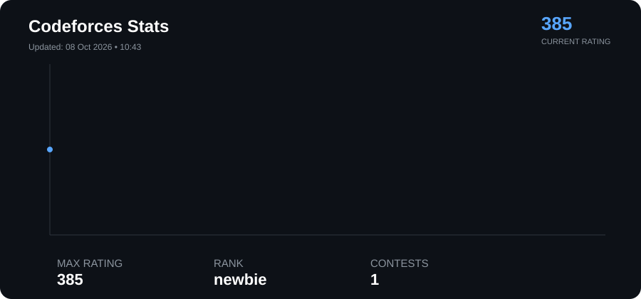
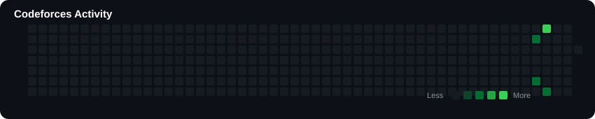

# ⚡ cpp-journey

<p align="center">
  <b>My journey through C++, DSA, algorithms, and competitive programming.</b>
</p>

<p align="center">
  
</p>

---
## 🔥 Codeforces Activity

<p align="center">
  
</p>
---

## 📊 My Competitive Programming Stats

The statistics above are automatically generated from my competitive programming activity.

### 🟦 Codeforces

<!-- CF_STATS_START -->

- **Current Rating:** 385
- **Maximum Rating:** 385
- **Rank:** newbie
- **Contests:** 1
- **Rating History:** 📈 1 contests

<!-- CF_STATS_END -->
### 🟩 Problem Solving

I practice problems across multiple platforms:

| Platform | Focus |
|----------|-------|
| 🟦 Codeforces | Competitive programming & contests |
| 🟩 CSES | Algorithms & problem solving |
| 🟨 AtCoder | Contest practice |
| ⚪ Personal Practice | Concepts & implementation |

---


---

## 📁 Repository Structure

```text
cpp-journey/
│
├── .github/
│   └── workflows/
│       └── update-stats.yml
│
├── codeforces/
│   ├── 800/
│   ├── 900/
│   ├── 1000/
│   ├── 1100/
│   └── contests/
│
├── cses/
│   ├── introductory/
│   ├── sorting-searching/
│   ├── dynamic-programming/
│   └── graphs/
│
├── atcoder/
│
├── practice/
│   ├── arrays/
│   ├── strings/
│   ├── bitwise/
│   ├── mathematics/
│   └── recursion/
│
├── templates/
│   └── cp_template.cpp
│
├── scripts/
│   ├── update_stats.py
│   └── generate_dashboard.py
│
├── assets/
│   └── cp-stats.svg
│
├── stats.json
├── LICENSE
└── README.md
